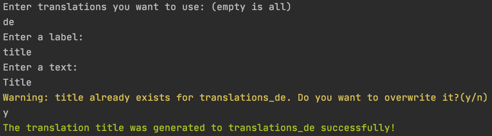

<div align=center>
<h1 style="border:0">Translations Generator</h1>
🌟 Generate translations in files for your project using cli. Support ts, js and json extensions. 🌟
</div>
<p>
<div align=center>
</div>

## Installation

1. Install package using npm or yarn.

   ```shell
   npm install translations-generator --save-dev
   ```

   or

   ```shell
   yarn add translations-generator -D
   ```

2. Add `translations.config.json` file to root of your directory.

   ```
       {
           ext: "js", // "ts", "js" or "json" (extention of translations),
           path: "src/translations", // path to folder with translations
           pattern: "translatations_", // (optional) specify pattern to use "en" instead of "translatations_en"
           alias: {
               "en": "translatations_en", // (optional) you can use "en" to specify translation
           }
       }
   ```

## Usage

Run command for adding translation to files

```shell
translations-generator
```

Run command for removing translation from files

```shell
translations-generator --remove-label
```

## Example

    .
    ├── src
    │   ├──translations
    │       ├── translation_en.js
    │       ├── translation_de.js
    │       ├── translation_nl.js
    │       │...
    │   ├──components
    │   ├──....
    ├── README.md
    ├── translations.config.json
    │...

```
   // translation_en.js

    export default {
        "title": "Title",
    };
```

Run `translations-generator`

You'll see

`Enter translations you want to use: (empty is all)`

`Enter a label: description`

`Enter a text: Description`

Output

```
   // translation_en.js

    export default {
        "title": "Title",
        "description": "Description",
    };
```

Generated files are ready! 🎉

### CONTRIBUTING

Feel free contribute to the project. More information you can find in [CONTRIBUTING](CONTRIBUTING.md) file.

### License

MIT – See [LICENSE](LICENSE) file.
